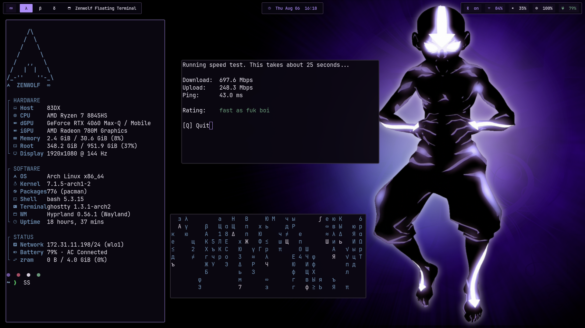
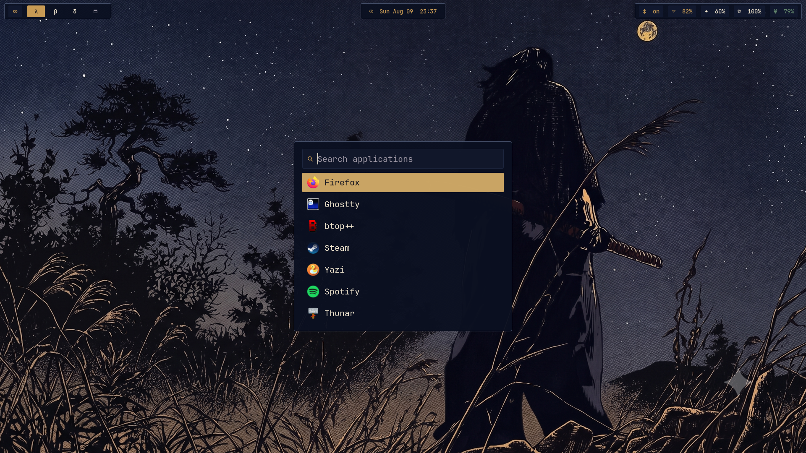
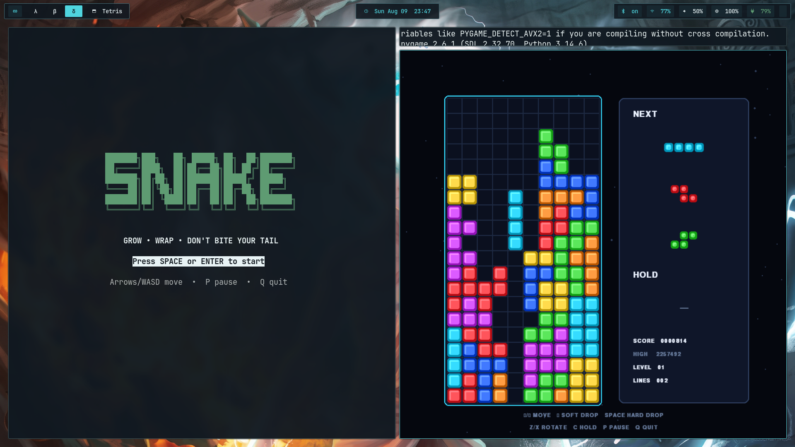
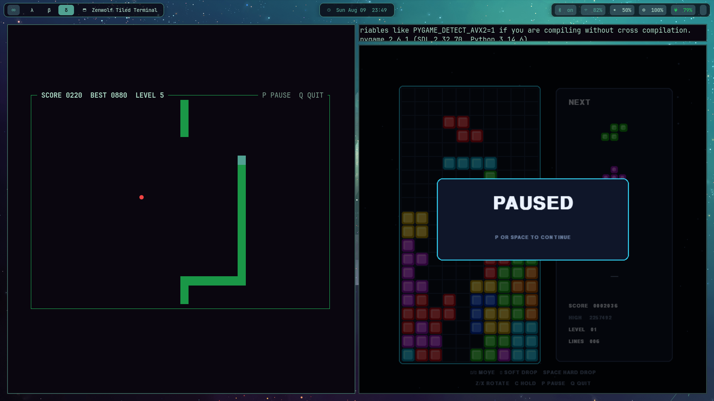

# Zenwolf dotfiles

Zenwolf is my keyboard-first Arch and Hyprland desktop. Nine coordinated
themes, a visual wallpaper picker, floating and tiled workspaces, and a bunch
of small quality-of-life details make the whole machine feel like one system.

Browse around and copy whatever you find useful. You do not need to adopt the
entire setup.



[Watch the 55-second Zenwolf tour](assets/videos/01-zenwolf-tour.mp4)

## Start here

- [`home/`](home/) maps the user configuration below your home directory.
- [`games/`](games/) contains standalone Snake and Tetris games.
- [`docs/build-guide.md`](docs/build-guide.md) explains how the pieces fit
  together and how to install them safely.
- [`docs/cheatsheet.md`](docs/cheatsheet.md) collects the shortcuts and everyday
  commands.

If you want the complete desktop, begin with a working Arch installation and
follow the build guide in order. Zenwolf's hardware layer was built for an AMD
display GPU with an optional NVIDIA GPU, so adapt that section rather than
copying another machine's identifiers. If you only want a theme, script, or
Rofi layout, take that piece and make it yours.



## Install and run

Start with a working Arch installation. Install the packages used by the
desktop and included games:

```bash
sudo pacman -Syu --needed \
  bash git rsync python python-pygame jq ripgrep nano cmark-gfm pciutils \
  hyprland hyprlock hyprpaper hyprpolkitagent \
  xdg-desktop-portal-hyprland xdg-desktop-portal-gtk \
  ghostty rofi waybar starship fastfetch \
  pipewire pipewire-audio pipewire-alsa pipewire-pulse wireplumber \
  brightnessctl playerctl bluez bluez-utils \
  grim slurp satty wf-recorder wl-clipboard libnotify \
  thunar tumbler ffmpegthumbnailer gvfs file-roller \
  thunar-archive-plugin thunar-volman udisks2 \
  yazi mpv swayimg zathura zathura-pdf-mupdf \
  btop htop cava firefox spotify-launcher cloudflare-speed-cli \
  xdg-user-dirs desktop-file-utils \
  noto-fonts noto-fonts-emoji ttf-jetbrains-mono-nerd otf-font-awesome
```

Clone the repository and preview the home-directory deployment:

```bash
git clone https://github.com/cleburn/zenwolf-dotfiles.git
cd zenwolf-dotfiles
rsync -avni home/ "$HOME/"
```

Before deploying `home/`, complete the hardware section of the [build
guide](docs/build-guide.md#hardware). Then copy without deleting unrelated files,
install the wallpapers, and start with one coordinated theme:

```bash
rsync -avi home/ "$HOME/"
install -d -m 755 ~/.local/share/zenwolf/wallpapers
install -m 644 assets/wallpapers/* ~/.local/share/zenwolf/wallpapers/
xdg-user-dirs-update
update-desktop-database ~/.local/share/applications
systemctl --user daemon-reload
export PATH="$HOME/.local/bin:$PATH"
zenwolf-theme-build check
zenwolf-theme elements
start-zenwolf-desktop
```

## Games

The two small games can run independently of the desktop:

```bash
python games/snake.py
python games/tetris_pygame.py
```

<p align="center">
  
  
</p>

## Credits

Zenwolf pulled ideas and inspiration from some really cool dotfile repos:

- [LierB/dotfiles](https://github.com/LierB/dotfiles)
- [maxhu08/dotfiles-old](https://github.com/maxhu08/dotfiles-old)
- [dilanrojas/dotfiles](https://github.com/dilanrojas/dotfiles)
- [Frewacom/pywalfox](https://github.com/Frewacom/pywalfox)
- [binnewbs/arch-hyprland](https://github.com/binnewbs/arch-hyprland)
- [x0d7x/dot](https://github.com/x0d7x/dot)
- [naveen-og/gilded-noir](https://github.com/naveen-og/gilded-noir)
